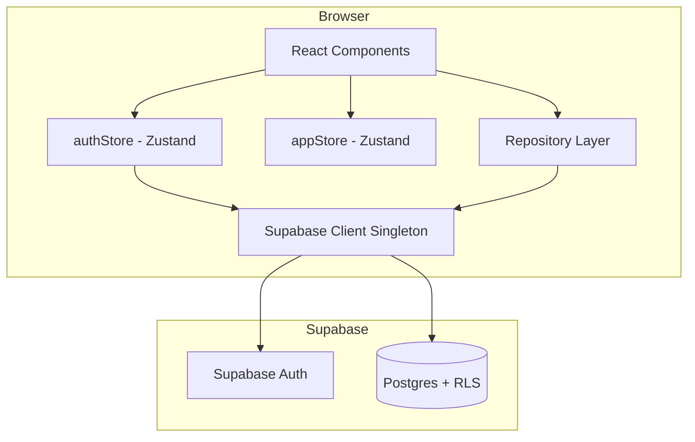

# Design Document: Dark Mode & Cloud Auth

## Overview

This design covers two additions to TradingParadise:

1. **Dark mode** — a permanent dark theme applied globally via Tailwind CSS v4 custom properties. No toggle; the app is always dark.
2. **Cloud authentication and storage** — replacing the local Dexie/IndexedDB data layer with Supabase (Postgres + Auth + Row Level Security). Users sign up, sign in, and access their data from any browser.

The existing repository pattern (`src/db/*Repository.ts`) is preserved as the public API. Internally, each repository switches from Dexie calls to Supabase client queries. Zustand stores continue to manage UI state; a new `authStore` handles session lifecycle.

No data migration from IndexedDB is provided. Cloud users start fresh.

## Architecture



**Key architectural decisions:**

- **Zustand for auth state** rather than React Context. The app already uses Zustand for all state management. Adding another pattern (Context) would fragment the codebase. Zustand's `subscribe` API also makes it straightforward to react to auth changes outside of React (e.g., in repository modules).
- **Repository pattern retained.** Components continue to call `createPlan(plan)`, `listPlans()`, etc. The implementation changes from Dexie to Supabase queries, but the interface stays the same. This minimizes churn in UI components.
- **No abstraction layer over Supabase.** The app targets Supabase specifically (not a generic "backend"). Wrapping Supabase in an adapter would add indirection without benefit since there's no plan to swap backends.
- **RLS as the security boundary.** The client sends the user's JWT with every request. Postgres RLS policies enforce that users can only access their own rows. The application code sets `user_id` on inserts but does not filter by `user_id` on reads — RLS handles that.

## Components and Interfaces

### 1. Supabase Client Module

**File:** `src/lib/supabase.ts`

```typescript
import { createClient, SupabaseClient } from '@supabase/supabase-js';

const supabaseUrl = import.meta.env.VITE_SUPABASE_URL;
const supabaseAnonKey = import.meta.env.VITE_SUPABASE_ANON_KEY;

if (!supabaseUrl || !supabaseAnonKey) {
  throw new Error(
    'Missing Supabase environment variables. Set VITE_SUPABASE_URL and VITE_SUPABASE_ANON_KEY in .env'
  );
}

export const supabase: SupabaseClient = createClient(supabaseUrl, supabaseAnonKey);
```

Singleton by module semantics — every import gets the same instance.

### 2. Auth Store

**File:** `src/stores/authStore.ts`

```typescript
interface AuthState {
  user: User | null;
  session: Session | null;
  isLoading: boolean;       // true while checking initial session
  error: string | null;

  initialize: () => Promise<void>;
  signUp: (email: string, password: string) => Promise<void>;
  signIn: (email: string, password: string) => Promise<void>;
  signOut: () => Promise<void>;
  resetPassword: (email: string) => Promise<void>;
  updatePassword: (newPassword: string) => Promise<void>;
  clearError: () => void;
}
```

`initialize()` is called once on app mount. It calls `supabase.auth.getSession()` to restore an existing session, then subscribes to `onAuthStateChange` for cross-tab sync.

### 3. Route Guard Component

**File:** `src/components/auth/ProtectedRoute.tsx`

```typescript
interface ProtectedRouteProps {
  children: React.ReactNode;
}
```

Reads `user` and `isLoading` from `authStore`. If `isLoading`, renders a full-page spinner. If `user` is null, redirects to `/login`. Otherwise renders `children`.

### 4. Auth Pages

| Page | Route | Purpose |
|------|-------|---------|
| LoginPage | `/login` | Email + password sign-in form |
| SignupPage | `/signup` | Email + password registration form |
| ResetPasswordPage | `/reset-password` | Request password reset email |
| UpdatePasswordPage | `/update-password` | Set new password (from reset link) |

All auth pages are public (no `ProtectedRoute` wrapper). They redirect to `/` if a session already exists.

### 5. Repository Layer (Refactored)

Each repository file replaces Dexie calls with Supabase queries. The function signatures remain identical.

Example — `planRepository.ts`:

```typescript
import { supabase } from '../lib/supabase';
import type { TradingPlan } from '../types/tradingPlan';

export async function createPlan(plan: TradingPlan): Promise<string> {
  const { data, error } = await supabase
    .from('plans')
    .insert({ ...plan, user_id: (await supabase.auth.getUser()).data.user?.id })
    .select('id')
    .single();
  if (error) throw error;
  return data.id;
}

export async function listPlans(): Promise<TradingPlan[]> {
  const { data, error } = await supabase
    .from('plans')
    .select('*')
    .order('updated_at', { ascending: false });
  if (error) throw error;
  return data;
}
```

The same pattern applies to `portfolioRepository`, `journalRepository`, `transactionRepository`, and a new `reminderRepository`.

### 6. Router Structure Update

```typescript
// Public routes (no guard)
{ path: 'login', element: <LoginPage /> },
{ path: 'signup', element: <SignupPage /> },
{ path: 'reset-password', element: <ResetPasswordPage /> },
{ path: 'update-password', element: <UpdatePasswordPage /> },

// Protected routes (wrapped in ProtectedRoute)
{
  element: <ProtectedRoute><AppLayout /></ProtectedRoute>,
  children: [
    { index: true, element: <DashboardPage /> },
    // ... existing routes unchanged
  ],
}
```

## Data Models

### Supabase Postgres Tables

All tables include a `user_id UUID NOT NULL DEFAULT auth.uid()` column and a foreign key to `auth.users(id)`.

Column naming uses `snake_case` in Postgres. The Supabase JS client can be configured to map to `camelCase` on the TypeScript side, or the repositories handle the mapping.

#### plans

| Column | Type | Notes |
|--------|------|-------|
| id | uuid PK | Generated client-side (uuid v4) |
| user_id | uuid FK | `auth.uid()` default |
| name | text | |
| author | text | |
| year | integer | |
| goals | jsonb | Array of Goal objects |
| greeks_targets | jsonb | Array of GreeksTarget objects |
| risk_management | jsonb | RiskManagement object |
| trade_rules | jsonb | Array of TradeRule objects |
| daily_management | jsonb | DailyManagement object |
| vacation_rules | jsonb | Array of VacationRule objects |
| market_regimes | jsonb | Array of MarketRegime objects |
| account_sizing | jsonb | AccountSizing object |
| core_strategies | jsonb | Array of Strategy objects |
| speculative_strategies | jsonb | Array of Strategy objects |
| created_at | timestamptz | |
| updated_at | timestamptz | |

Nested arrays (goals, strategies, etc.) are stored as JSONB columns. This matches the existing Dexie approach where the entire plan object is stored as one document. It avoids a complex relational schema for deeply nested data that is always read/written as a unit.

#### portfolios

| Column | Type | Notes |
|--------|------|-------|
| id | uuid PK | |
| user_id | uuid FK | |
| name | text | |
| description | text | |
| initial_balance | numeric | |
| plan_id | uuid FK → plans.id | |
| created_at | timestamptz | |
| updated_at | timestamptz | |

#### journal_entries

| Column | Type | Notes |
|--------|------|-------|
| id | uuid PK | |
| user_id | uuid FK | |
| stock_symbol | text | |
| open_date | date | |
| expiration_date | date | |
| option_type | text | 'Call' or 'Put' |
| direction | text | 'Buy' or 'Sell' |
| stock_price_doc | numeric | |
| dte | integer | |
| ditc | integer | |
| current_stock_price | numeric | nullable |
| break_even_price | numeric | |
| strike_price | numeric | |
| premium | numeric | |
| cash_reserve | numeric | |
| margin_cash_reserve | numeric | nullable |
| fees | numeric | |
| exit_price | numeric | nullable |
| close_date | date | nullable |
| profit_loss | numeric | nullable |
| win_loss | text | nullable |
| days_held | integer | nullable |
| annualized_ror | numeric | nullable |
| margin_annualized_ror | numeric | nullable |
| trade_status | text | |
| portfolio_id | uuid FK | |
| strategy_id | text | |
| plan_id | uuid FK | |
| unrealized_pl | numeric | nullable |
| notes | text | |
| created_at | timestamptz | |
| updated_at | timestamptz | |

#### reminders

| Column | Type | Notes |
|--------|------|-------|
| id | uuid PK | |
| user_id | uuid FK | |
| title | text | |
| description | text | |
| strategy_id | text | nullable |
| activity_type | text | nullable |
| date | date | |
| time | text | "HH:mm" |
| recurrence | text | |
| status | text | |
| plan_id | uuid FK | |
| created_at | timestamptz | |
| updated_at | timestamptz | |

#### portfolio_transactions

| Column | Type | Notes |
|--------|------|-------|
| id | uuid PK | |
| user_id | uuid FK | |
| portfolio_id | uuid FK | |
| plan_id | uuid FK | |
| transaction_date | date | |
| settlement_date | date | nullable |
| symbol | text | |
| description | text | |
| transaction_type | text | |
| asset_type | text | |
| option_type | text | nullable |
| strike_price | numeric | nullable |
| expiration_date | date | nullable |
| quantity | numeric | |
| price | numeric | |
| amount | numeric | |
| fees | numeric | |
| source | text | |
| raw_description | text | nullable |
| strategy_id | text | nullable |
| margin_used | numeric | nullable |
| annualized_return | numeric | nullable |
| return_on_margin | numeric | nullable |
| created_at | timestamptz | |
| updated_at | timestamptz | |

### RLS Policies (applied to all five tables)

```sql
-- Enable RLS
ALTER TABLE plans ENABLE ROW LEVEL SECURITY;

-- SELECT: user can only read own rows
CREATE POLICY "Users can read own data"
  ON plans FOR SELECT
  USING (auth.uid() = user_id);

-- INSERT: user_id must match authenticated user
CREATE POLICY "Users can insert own data"
  ON plans FOR INSERT
  WITH CHECK (auth.uid() = user_id);

-- UPDATE: can only update own rows
CREATE POLICY "Users can update own data"
  ON plans FOR UPDATE
  USING (auth.uid() = user_id);

-- DELETE: can only delete own rows
CREATE POLICY "Users can delete own data"
  ON plans FOR DELETE
  USING (auth.uid() = user_id);
```

Same four policies are created for `portfolios`, `journal_entries`, `reminders`, and `portfolio_transactions`.

### Dark Mode Color Palette

Defined as CSS custom properties in `src/index.css` using Tailwind v4's `@theme` directive:

```css
@theme {
  --color-surface-primary: #0f172a;    /* slate-900 — main background */
  --color-surface-secondary: #1e293b;  /* slate-800 — cards, sidebar */
  --color-surface-tertiary: #334155;   /* slate-700 — hover states, borders */
  --color-text-primary: #f1f5f9;       /* slate-100 — body text */
  --color-text-secondary: #94a3b8;     /* slate-400 — muted text */
  --color-text-accent: #38bdf8;        /* sky-400 — links, active states */
  --color-border: #334155;             /* slate-700 */
  --color-input-bg: #1e293b;           /* slate-800 — form inputs */
  --color-success: #4ade80;            /* green-400 */
  --color-error: #f87171;              /* red-400 */
  --color-warning: #fbbf24;            /* amber-400 */
}
```

Components reference these tokens: `bg-surface-primary`, `text-text-primary`, `border-border`, etc. This keeps the palette centralized and easy to adjust.

## Correctness Properties

*A property is a characteristic or behavior that should hold true across all valid executions of a system — essentially, a formal statement about what the system should do. Properties serve as the bridge between human-readable specifications and machine-verifiable correctness guarantees.*

### Property 1: Password validation boundary

*For any* string of length less than 8, the client-side password validator SHALL reject it. *For any* string of length 8 or greater, the validator SHALL accept it.

**Validates: Requirements 3.5**

### Property 2: Sign-out clears all user-specific state

*For any* application state containing user data (plans, portfolios, journal entries, reminders, transactions, active plan ID), after sign-out completes, all user-specific fields in the auth store and app store SHALL be reset to their initial empty values.

**Validates: Requirements 5.3**

### Property 3: Route guard access is determined by session existence

*For any* protected route path, if no active session exists, navigation SHALL result in a redirect to the sign-in page. Conversely, *for any* protected route path, if an active session exists, navigation SHALL render the route's component without redirect.

**Validates: Requirements 7.1, 7.2**

### Property 4: Every created record includes the authenticated user's ID

*For any* valid record (plan, portfolio, journal entry, reminder, or transaction) passed to a repository create function, the resulting database insert SHALL include a `user_id` field equal to the currently authenticated user's ID.

**Validates: Requirements 8.2**

### Property 5: Data schema round-trip preservation

*For any* valid record object, storing it via the repository layer and then retrieving it by ID SHALL produce an object with all original field values preserved (accounting for Date serialization to ISO strings and back).

**Validates: Requirements 8.4**

### Property 6: Network errors surface as user-visible error messages

*For any* data layer operation (create, read, update, delete) that fails due to a network error, the application SHALL display an error message to the user (via the toast system).

**Validates: Requirements 11.3**

## Error Handling

### Strategy

Errors are categorized into three tiers:

| Tier | Source | Handling |
|------|--------|----------|
| Auth errors | Supabase Auth responses (invalid credentials, weak password, duplicate email) | Displayed inline on the auth form via `authStore.error`. Cleared on next submission or via `clearError()`. |
| Data errors | Supabase query failures (network timeout, RLS violation, constraint violation) | Caught in repository functions, re-thrown as typed errors. Zustand stores catch these and call `appStore.addToast(message, 'error')`. |
| Unexpected errors | Runtime exceptions, unhandled promise rejections | Caught by the existing `ErrorBoundary` component. Renders a fallback UI with a retry option. |

### Auth Error Mapping

```typescript
function mapAuthError(error: AuthError): string {
  switch (error.message) {
    case 'User already registered':
      return 'An account with this email already exists.';
    case 'Invalid login credentials':
      return 'Email or password is incorrect.';
    case 'Password should be at least 8 characters':
      return 'Password must be at least 8 characters.';
    default:
      return 'An unexpected error occurred. Please try again.';
  }
}
```

### Network Error Handling in Repositories

Each repository function wraps Supabase calls in a try/catch. On `PostgrestError` or network failure, the error is thrown with a descriptive message. The calling Zustand store action catches it and dispatches a toast:

```typescript
// In a store action
try {
  await createPlan(planData);
} catch (err) {
  useAppStore.getState().addToast(
    err instanceof Error ? err.message : 'Failed to save plan',
    'error'
  );
}
```

### Session Expiry

When `onAuthStateChange` fires with event `TOKEN_REFRESHED` failure or `SIGNED_OUT`, the auth store clears user state and the router guard redirects to `/login`. No stale data remains in memory.

## Testing Strategy

### Unit Tests (Vitest + Testing Library)

- Auth form components: verify form validation, error display, loading states, and submit behavior with mocked `authStore`.
- Route guard: verify redirect behavior for unauthenticated users and passthrough for authenticated users.
- Repository functions: mock `supabase` client, verify correct query construction and error propagation.
- Dark mode: snapshot tests confirming dark color classes on key layout components.

### Property-Based Tests (fast-check + Vitest)

The project already has `fast-check` as a dev dependency. Each correctness property maps to a single property-based test with a minimum of 100 iterations.

| Property | Test approach |
|----------|--------------|
| 1: Password validation | Generate random strings (0–100 chars), assert validation result matches length >= 8 |
| 2: Sign-out clears state | Generate random user state objects, call sign-out logic, assert all fields reset |
| 3: Route guard | Generate random route paths from the protected set, assert redirect/render based on session |
| 4: User ID on create | Generate random record data, mock auth user, call create, assert user_id in insert payload |
| 5: Data round-trip | Generate random valid records, mock Supabase insert/select, assert field equality |
| 6: Network error → toast | Generate random operation types, mock network failure, assert toast dispatched |

Tag format: `// Feature: dark-mode-and-cloud-auth, Property N: <description>`

### Integration Tests

- Supabase RLS: two authenticated test users, verify user A cannot read/update/delete user B's data.
- Auth flow end-to-end: sign-up → sign-in → sign-out cycle against a Supabase test project.

### Accessibility

- Automated contrast checks via axe-core in component tests.
- Manual screen reader testing for auth forms (labels, error announcements, focus management).
