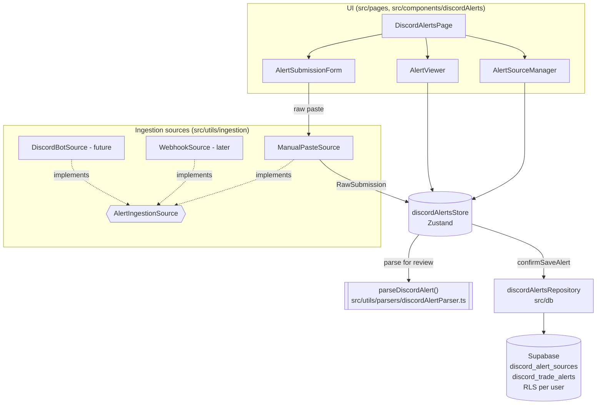
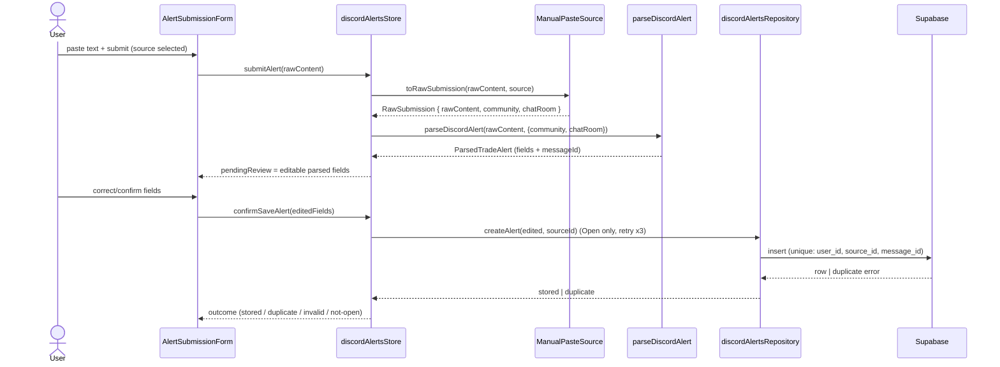

# Design Document: Discord Trade Alerts

## Overview

The Discord Trade Alerts feature adds a dedicated section to TradingParadise for ingesting options trade alerts posted in Discord communities and storing them per-user in Supabase. It reuses the existing conventions of the app: sequential SQL migrations with Row Level Security (RLS), a thin camelCase repository layer over the shared `supabase` client, Zustand stores that surface errors through `useAppStore().addToast`, lazy-loaded protected routes, and the Tailwind theme tokens used across the UI.

This design satisfies **Requirements 1-7** and is anchored on three decisions that are already settled:

1. **Ingestion is manual paste today, swappable later.** An `AlertIngestionSource` interface produces normalized `RawSubmission` objects. `ManualPasteSource` is the only implementation in the initial build; a `WebhookSource` and a future `DiscordBotSource` slot in behind the same interface without touching the stored data model (**Requirement 3.6**). We deliberately do **not** use the user's Discord account token — automating a personal account violates Discord's Terms of Service — and a bot reader requires a server-admin install, so it stays out of the initial build.
2. **The parser POC is reused as-is.** `src/utils/parsers/discordAlertParser.ts` is already built, documented, and unit-tested. The design consumes its public surface (`parseDiscordAlert`, `ParsedTradeAlert`, and the `AlertActionType` / `AlertDirection` / `AmountKind` types) and does not redesign parsing. The parser is a pure, deterministic function and derives a stable `messageId` via an inline FNV-1a hash of `community + chatRoom + rawContent`.
3. **Parse-then-review UX.** POC findings show the regex heuristics extract structured alerts (Examples 1 & 2) reliably, but free-form alerts (Example 3) can leave `symbol`/`direction` empty, and `fillPrice` vs `amount` can overlap. So the submission flow parses first, shows the parsed fields in an **editable review form**, and only persists a `Trade_Alert` after the user confirms. This directly de-risks imperfect extraction and satisfies **Requirements 5 and 7**.

The initial build stores only `Open` alerts for a single community ("Mak's Money Maker Club" / "elite-trade-alerts"), but the classifier and data model already handle `Adjust`/`Close` so later expansion needs no schema change (**Requirement 4.6**).

> **Migration numbering correction.** The task brief assumed `010_decouple_portfolio_from_plan.sql` was the latest migration and that the new file should be `011_...`. The workspace already contains `011_add_stock_transaction_support.sql`, so the next free sequential number is **012**. This design uses `supabase/migrations/012_discord_trade_alerts.sql`. Confirm the number is still free at implementation time and bump if another migration lands first.

## Architecture

The feature follows the existing four-layer flow used by Portfolio and Holdings: **UI components → Zustand store → repository → Supabase**. The parser sits beside the store as a pure utility. Ingestion sources sit in front of the store, normalizing whatever the user submits into a single `RawSubmission` shape.



Submission is a two-step interaction (parse-then-review), so the store holds a transient "pending review" object between `submitAlert` and `confirmSaveAlert`:



## Data Models

Two tables mirror the style of `008_portfolio_holdings.sql`: `id`/`user_id`/`created_at`/`updated_at` defaults, a `user_id` FK to `auth.users` with `ON DELETE CASCADE`, a unique constraint, a supporting index, `ENABLE ROW LEVEL SECURITY`, and a concise `FOR ALL` policy.

- **`discord_alert_sources`** — one row per Community + Chat_Room the user configures (**Requirement 2**). Case-insensitive, whitespace-trimmed uniqueness (**Requirement 2.5**) needs an expression-based unique index (a plain `UNIQUE(...)` cannot span `lower(...)` expressions). Length bounds 1..100 are enforced with `CHECK` constraints on the trimmed length (**Requirement 2.1**).
- **`discord_trade_alerts`** — one row per stored `Trade_Alert`, referencing its source with `ON DELETE CASCADE` so deleting a source removes its alerts (**Requirement 2.7**). `UNIQUE(user_id, source_id, message_id)` enforces de-duplication (**Requirements 3.4, 6.3**). A single `action_type TEXT` column covers `Open`/`Adjust`/`Close`/`Unclassified` so enabling Adjust/Close later needs no schema change (**Requirement 4.6**). Structured fields are all nullable because the parser leaves un-extracted fields null (**Requirement 5.4**), and `raw_content` is always retained (**Requirements 5.7, 6.1**). `links` is `JSONB` (the parser returns a deduped array capped at 50 — **Requirement 5.8**).

### Migration: `supabase/migrations/012_discord_trade_alerts.sql`

```sql
-- Discord Trade Alerts: alert sources (community + chat room) and stored trade alerts.
-- Per-user RLS consistent with existing tables (see 008_portfolio_holdings.sql).

-- =============================================================================
-- discord_alert_sources
-- =============================================================================
CREATE TABLE discord_alert_sources (
  id UUID PRIMARY KEY DEFAULT gen_random_uuid(),
  user_id UUID NOT NULL DEFAULT auth.uid() REFERENCES auth.users(id) ON DELETE CASCADE,
  community TEXT NOT NULL,
  chat_room TEXT NOT NULL,
  created_at TIMESTAMPTZ NOT NULL DEFAULT now(),
  updated_at TIMESTAMPTZ NOT NULL DEFAULT now(),
  -- Requirement 2.1: community and chat room names are 1..100 characters (trimmed).
  CONSTRAINT discord_alert_sources_community_len
    CHECK (char_length(btrim(community)) BETWEEN 1 AND 100),
  CONSTRAINT discord_alert_sources_chat_room_len
    CHECK (char_length(btrim(chat_room)) BETWEEN 1 AND 100)
);

-- Requirement 2.5: case-insensitive, trimmed duplicate prevention per user.
-- Expression-based uniqueness requires a unique index (not a UNIQUE constraint).
CREATE UNIQUE INDEX idx_discord_alert_sources_unique
  ON discord_alert_sources (user_id, lower(btrim(community)), lower(btrim(chat_room)));

ALTER TABLE discord_alert_sources ENABLE ROW LEVEL SECURITY;
CREATE POLICY "Users manage own discord_alert_sources"
  ON discord_alert_sources FOR ALL USING (auth.uid() = user_id);

-- =============================================================================
-- discord_trade_alerts
-- =============================================================================
CREATE TABLE discord_trade_alerts (
  id UUID PRIMARY KEY DEFAULT gen_random_uuid(),
  user_id UUID NOT NULL DEFAULT auth.uid() REFERENCES auth.users(id) ON DELETE CASCADE,
  source_id UUID NOT NULL REFERENCES discord_alert_sources(id) ON DELETE CASCADE, -- Requirement 2.4, 2.7
  message_id TEXT NOT NULL,                 -- Requirement 3.2 (parser-derived FNV-1a hash)
  raw_content TEXT NOT NULL,                -- Requirement 5.7, 6.1 (always retained)
  submission_timestamp TIMESTAMPTZ NOT NULL, -- Requirement 3.2, 7.2
  action_type TEXT NOT NULL,                -- Requirement 4.1, 4.6 (Open/Adjust/Close/Unclassified)
  -- Extracted structured fields (all nullable; Requirement 5.4/5.5)
  symbol TEXT,
  strategy TEXT,
  expiration TEXT,
  strikes TEXT,
  direction TEXT,                           -- 'buy' | 'sell' (Requirement 5.2)
  fill_price NUMERIC,
  amount NUMERIC,
  amount_kind TEXT,                         -- 'credit' | 'debit' (Requirement 5.3)
  links JSONB NOT NULL DEFAULT '[]',        -- Requirement 5.8 (<= 50, deduped)
  extracted_any_field BOOLEAN NOT NULL DEFAULT false, -- Requirement 5.6
  created_at TIMESTAMPTZ NOT NULL DEFAULT now(),
  updated_at TIMESTAMPTZ NOT NULL DEFAULT now(),
  -- Requirement 3.4 / 6.3: de-duplication per user + source + message id.
  UNIQUE(user_id, source_id, message_id)
);

CREATE INDEX idx_discord_trade_alerts_source ON discord_trade_alerts(source_id);

ALTER TABLE discord_trade_alerts ENABLE ROW LEVEL SECURITY;
CREATE POLICY "Users manage own discord_trade_alerts"
  ON discord_trade_alerts FOR ALL USING (auth.uid() = user_id);
```

**RLS note (Requirements 6.4, 6.7):** The `FOR ALL USING (auth.uid() = user_id)` policy scopes every SELECT/INSERT/UPDATE/DELETE to the authenticated user. A delete targeting another user's row simply matches zero rows — the row is preserved and no error path is needed client-side.

## Components and Interfaces

### Repository — `src/db/discordAlertsRepository.ts`

Follows `holdingsRepository.ts` exactly: exported camelCase row interfaces, `fromRow` mappers, functions over the shared `supabase` client from `../lib/supabase`, user resolved via `(await supabase.auth.getUser()).data.user?.id` (throw `'Not authenticated'` if missing), and every function throwing `new Error('Failed to ...: ' + error.message)` on a Supabase error.

```typescript
import { supabase } from '../lib/supabase';
import type { ParsedTradeAlert } from '../utils/parsers/discordAlertParser';

export interface DiscordAlertSource {
  id: string;
  community: string;
  chatRoom: string;
  createdAt: Date;
  updatedAt: Date;
}

export interface DiscordTradeAlert {
  id: string;
  sourceId: string;
  messageId: string;
  rawContent: string;
  submissionTimestamp: Date;
  actionType: ParsedTradeAlert['actionType'];
  symbol: string | null;
  strategy: string | null;
  expiration: string | null;
  strikes: string | null;
  direction: ParsedTradeAlert['direction'];
  fillPrice: number | null;
  amount: number | null;
  amountKind: ParsedTradeAlert['amountKind'];
  links: string[];
  extractedAnyField: boolean;
  createdAt: Date;
  updatedAt: Date;
}

/** Grouped shape for the viewer (Requirement 6.5 / 7.1). */
export interface GroupedAlerts {
  source: DiscordAlertSource;
  alerts: DiscordTradeAlert[];
}

function fromSourceRow(row: Record<string, unknown>): DiscordAlertSource { /* map snake_case -> camelCase */ }
function fromAlertRow(row: Record<string, unknown>): DiscordTradeAlert { /* map snake_case -> camelCase, links as string[] */ }

export async function listSources(): Promise<DiscordAlertSource[]>;
export async function createSource(community: string, chatRoom: string): Promise<DiscordAlertSource>;
export async function updateSource(id: string, changes: Partial<Pick<DiscordAlertSource, 'community' | 'chatRoom'>>): Promise<void>;
export async function deleteSource(id: string): Promise<void>; // cascade deletes alerts (Requirement 2.7)

export async function listAlertsBySource(sourceId: string): Promise<DiscordTradeAlert[]>;
export async function listAlertsGrouped(): Promise<GroupedAlerts[]>; // Requirement 6.5
export async function createAlert(parsed: ParsedTradeAlert, sourceId: string): Promise<DiscordTradeAlert>; // retry x3
export async function deleteAlert(id: string): Promise<void>;
```

- `createAlert` wraps the insert in a small retry helper (up to 3 attempts) per **Requirement 6.2** — see Error Handling. It maps the (possibly user-edited) `ParsedTradeAlert` to the row, always including `source_id` and `submission_timestamp`, and returns the inserted row.
- `listAlertsBySource` orders by `submission_timestamp` descending with `id` as the deterministic secondary key so ties are stable across reads (**Requirements 7.2, 7.3**). Client-side `sortAlerts` re-applies the same ordering for in-memory updates.
- Duplicate inserts surface as a Postgres unique-violation; `createAlert` detects it and reports `'duplicate'` rather than throwing a generic failure (**Requirements 3.4, 6.3**).

### Store — `src/stores/discordAlertsStore.ts`

Mirrors `portfolioStore.ts`: `create<State>((set, get) => ({...}))`, an `isLoading` flag, async actions that call the repo and route errors to `useAppStore.getState().addToast(message, 'error')`. Adds a transient `pendingReview` for the parse-then-review flow.

```typescript
interface SubmitOutcome {
  status: 'review' | 'stored' | 'duplicate' | 'invalid' | 'not-open';
  message?: string;
}

interface DiscordAlertsState {
  sources: DiscordAlertSource[];
  grouped: GroupedAlerts[];          // Requirement 6.5 / 7.1
  currentSourceId: string | null;
  pendingReview: ParsedTradeAlert | null; // held between submitAlert and confirmSaveAlert
  isLoading: boolean;

  loadSources: () => Promise<void>;
  createSource: (community: string, chatRoom: string) => Promise<void>;
  updateSource: (id: string, changes: Partial<Pick<DiscordAlertSource, 'community' | 'chatRoom'>>) => Promise<void>;
  deleteSource: (id: string) => Promise<void>;
  selectSource: (id: string) => void;
  loadAlerts: () => Promise<void>;
  submitAlert: (rawContent: string) => SubmitOutcome;        // parse + validate, sets pendingReview
  confirmSaveAlert: (edited: ParsedTradeAlert) => Promise<SubmitOutcome>; // persist after review
  deleteAlert: (id: string) => Promise<void>;
}
```

- `submitAlert` runs the selected source through `ManualPasteSource`, rejects empty/whitespace-only content with `{ status: 'invalid' }` and no persistence (**Requirement 3.3**), truncates to 10,000 chars (**Requirement 3.1**), runs `parseDiscordAlert`, and stores the result in `pendingReview` returning `{ status: 'review' }`. It is synchronous — no I/O yet.
- `confirmSaveAlert` gates on the initial-build policy: only `actionType === 'Open'` persists; `Adjust`/`Close`/`Unclassified` return `{ status: 'not-open' }` and inform the user (**Requirements 4.4, 4.5**). On success it calls `repo.createAlert`, refreshes `grouped`, clears `pendingReview`, and returns `stored` or `duplicate`.

### Ingestion source abstraction — `src/utils/ingestion/`

The swappable seam for **Requirement 3.6**. Every source normalizes its input to a single `RawSubmission`; downstream code (parser, store, repo, schema) never learns which source produced it.

```typescript
// src/utils/ingestion/types.ts
export interface RawSubmission {
  rawContent: string;
  community: string;
  chatRoom: string;
  /** Optional source-provided id (webhook/bot). Manual paste omits this and lets the parser derive one. */
  externalMessageId?: string;
}

export interface AlertIngestionSource {
  readonly kind: 'manual-paste' | 'webhook' | 'discord-bot';
  /** Produce raw submissions. Manual paste yields exactly one per call. */
  toRawSubmissions(input: unknown, source: { community: string; chatRoom: string }): RawSubmission[];
}

// src/utils/ingestion/manualPasteSource.ts  -- the only implementation in the initial build
export class ManualPasteSource implements AlertIngestionSource { readonly kind = 'manual-paste'; /* ... */ }
```

`WebhookSource` (inbound HTTP payload → one or more `RawSubmission`) and `DiscordBotSource` (live channel reader; requires a **server-admin bot install** and must **never** use the user's account token) are added later behind the same interface with no data-model change.

### Routing & UI

**Routing — `src/App.tsx`.** Add a lazy page and a protected child route, matching the `lazyWithRetry` + `Suspense` pattern:

```typescript
const DiscordAlertsPage = lazyWithRetry(() => import('./pages/DiscordAlertsPage'));
// ...inside the ProtectedRoute/AppLayout children array:
{
  path: 'discord-alerts',
  element: (
    <Suspense fallback={<LoadingFallback />}>
      <DiscordAlertsPage />
    </Suspense>
  ),
},
```

**Sidebar — `src/components/layout/Sidebar.tsx`.** Add one `navItems` entry using a lucide-react icon (**Requirement 1.1**):

```typescript
import { BellRing } from 'lucide-react';
// ...
{ to: '/discord-alerts', label: 'Alerts', icon: BellRing },
```

The `navItems` array currently has 8 entries and the mobile bottom-nav renders only `navItems.slice(0, 5)`. To keep "Alerts" visible on mobile it must sit within the first five (e.g., insert it right after `Journal`); if it is placed later it will only appear in the desktop sidebar. Active-state styling and single-selection (**Requirements 1.3**) come for free from the existing `NavLink` + `linkClass` logic.

**Component breakdown** (all under `src/pages/` and `src/components/discordAlerts/`), each mapped to requirements:

- **`DiscordAlertsPage`** (`src/pages/DiscordAlertsPage.tsx`) — route container. On mount calls `loadSources` + `loadAlerts`, renders the source selector, `AlertSourceManager`, `AlertSubmissionForm`, and `AlertViewer`. Renders the Alert_Viewer as active content (**Requirements 1.2, 1.4, 7**).
- **`AlertSourceManager`** — list/create/edit/delete sources with inline length validation (1..100, trimmed) and case-insensitive duplicate detection before calling the store; delete shows the associated alert count and a confirmation warning before deleting (**Requirement 2** incl. 2.1, 2.3, 2.5, 2.6, 2.7).
- **`AlertSubmissionForm`** — paste box → `submitAlert` → renders the parsed fields in an **editable review form** → `confirmSaveAlert`. Surfaces the outcome (stored / duplicate / invalid / not-open) inline (**Requirements 3, 4, 5**).
- **`AlertViewer`** — alerts grouped by Community/Chat_Room, reverse-chronological by `submissionTimestamp` with `id` as the deterministic secondary sort, each alert showing its extracted fields (name + value), an Action_Type badge, a reveal control for full `rawContent`, and links as navigable anchors; renders an empty state when a source has no alerts (**Requirements 6.5, 7.1-7.7**).

All components use the existing Tailwind theme tokens seen in `Sidebar.tsx` (`text-text-primary`, `text-text-secondary`, `bg-surface-secondary`, `bg-surface-tertiary`, `border-border`, `text-text-accent`, `bg-input-bg`).

## Parsing Design

Parsing is **not** redesigned. The feature imports and reuses the validated POC at `src/utils/parsers/discordAlertParser.ts`:

- **Entry point:** `parseDiscordAlert(rawContent, { community, chatRoom }): ParsedTradeAlert`.
- **Types consumed:** `AlertActionType = 'Open'|'Adjust'|'Close'|'Unclassified'`, `AlertDirection = 'buy'|'sell'`, `AmountKind = 'credit'|'debit'`, and `ParsedTradeAlert` (`actionType, symbol, strategy, expiration, strikes, direction, fillPrice, amount, amountKind, links, rawContent, messageId, extractedAnyField`).
- **Determinism & message id:** the parser is pure; `messageId` is a stable FNV-1a hash of `community + chatRoom + rawContent`, which is exactly the `message_id` persisted and used for de-duplication (**Requirements 3.2, 4.2, 3.4/6.3**).
- **Classification** (**Requirement 4**): earliest-keyword-wins across Open/Adjust/Close keyword sets plus opening-spread phrases; anything unmatched is `Unclassified`.
- **Extraction** (**Requirement 5**): each structured field is best-effort and left `null` when not confidently extractable; `rawContent` is always retained; `extractedAnyField` reports whether anything was extracted; `links` are deduped, order-preserving, capped at 50.

**Why parse-then-review (Requirement 5 / 7 de-risking):** POC results show structured alerts (Examples 1 & 2) parse cleanly, but free-form ones (Example 3) can leave `symbol`/`direction` empty and can confuse `fillPrice` with `amount`. Rather than silently persist imperfect extraction, `AlertSubmissionForm` presents the parsed fields for the user to correct and confirm. The user's edits are applied to the `ParsedTradeAlert` before `confirmSaveAlert` persists it. Editing structured fields does **not** change `messageId` (it is derived from raw content + source), so de-duplication remains stable regardless of edits.

## Ingestion Source Abstraction

Covered in Components above; summarized here for **Requirement 3.6**. The `AlertIngestionSource` interface is the single seam that makes ingestion swappable. The store depends only on `RawSubmission`, and `RawSubmission` maps 1:1 onto the parser input and the persisted columns. Consequences:

- **Now:** `ManualPasteSource` turns one pasted string + selected source into one `RawSubmission`.
- **Later (no schema change):** `WebhookSource` turns an inbound HTTP payload into `RawSubmission[]`; `DiscordBotSource` streams channel messages into `RawSubmission[]`. Both may supply `externalMessageId`; the persistence layer prefers it when present and otherwise uses the parser-derived hash — either way the `(user_id, source_id, message_id)` uniqueness rule is what enforces de-dup.
- **Compliance guardrails:** no personal-account-token automation (Discord ToS); the bot path requires a server-admin install and is explicitly deferred.

## State Management

`discordAlertsStore` (detailed above) holds `sources`, `grouped`, `currentSourceId`, `pendingReview`, and `isLoading`, following the `portfolioStore` conventions:

- Async actions set `isLoading` around repo calls and clear it in `finally`.
- All error paths call `useAppStore.getState().addToast(message, 'error')` rather than throwing to the component.
- `pendingReview` is the only piece of transient, non-persisted state; it exists solely to carry parsed fields from `submitAlert` to `confirmSaveAlert`. It is cleared on successful save, on cancel, and on source switch.
- In-memory list mutations (after create/delete) re-derive `grouped` using the pure `groupBySource` + `sortAlerts` helpers so the UI stays consistent without a full reload.

## Error Handling

| Scenario | Behavior | Requirement |
|---|---|---|
| Persistence failure | `createAlert` retries the insert up to 3 times (retaining the unsaved data); if all attempts fail it surfaces a failure toast and the review form keeps the entered data so the user can retry | 6.2 |
| Duplicate submission | Unique-violation on `(user_id, source_id, message_id)` is caught and reported as a user-facing "already saved" message; the existing row is untouched | 3.4, 6.3 |
| Empty / whitespace-only submission | `submitAlert` returns `{ status: 'invalid' }`, shows a validation message, and never reaches the repo | 3.3 |
| Non-Open in initial build | `confirmSaveAlert` returns `{ status: 'not-open' }` and informs the user nothing was stored | 4.5 |
| Cross-user delete | RLS `USING (auth.uid() = user_id)` matches zero rows; the targeted alert is preserved | 6.7 |
| Alert_Viewer load failure | `loadAlerts` catches the error, sets an error indication in state, shows an error toast, and the Discord Alerts nav item stays selected | 1.5 |
| Not authenticated | Repo throws `'Not authenticated'` (same as `holdingsRepository`); store converts to a toast | 6.4 |

Retry helper shape (in `discordAlertsRepository.ts`):

```typescript
async function withRetry<T>(op: () => Promise<T>, attempts = 3): Promise<T> {
  let lastErr: unknown;
  for (let i = 0; i < attempts; i++) {
    try { return await op(); } catch (err) {
      lastErr = err;
      if (isUniqueViolation(err)) throw err; // duplicates are not retried
    }
  }
  throw lastErr;
}
```

## Correctness Properties

*A property is a characteristic or behavior that should hold true across all valid executions of a system-essentially, a formal statement about what the system should do. Properties serve as the bridge between human-readable specifications and machine-verifiable correctness guarantees.*

The parser is a pure, deterministic function and several store/repo helpers (`sortAlerts`, `groupBySource`, the source-name validator, the duplicate-source predicate, the raw-content cap, the insert-payload mapper, the initial-build gate) are pure functions over well-defined input spaces, so property-based testing applies to the logic layer. RLS behavior (Requirements 6.4, 6.7) and the retry side-effect (6.2) are covered by integration and example tests instead.

### Property 1: Parser determinism

*For any* `rawContent` string and any `{ community, chatRoom }` source, calling `parseDiscordAlert` twice produces deeply-equal `ParsedTradeAlert` results, including an identical `messageId`.

**Validates: Requirements 4.2, 3.2**

### Property 2: Action type is always in the fixed set

*For any* `rawContent` string, `parseDiscordAlert(...).actionType` is exactly one of `Open`, `Adjust`, `Close`, or `Unclassified` (and empty/gibberish input yields `Unclassified`).

**Validates: Requirements 4.1, 4.3**

### Property 3: Parser preserves raw content exactly

*For any* `rawContent` string, `parseDiscordAlert(...).rawContent` equals the input unchanged, regardless of which structured fields were extracted.

**Validates: Requirements 5.4, 5.5, 5.7**

### Property 4: Parser output fields lie in their declared domains

*For any* `rawContent` string, `direction ∈ {'buy','sell',null}`, `amountKind ∈ {'credit','debit',null}`, and `amount`/`fillPrice` are each a number or null.

**Validates: Requirements 5.2, 5.3**

### Property 5: `extractedAnyField` reflects extraction

*For any* `rawContent` string, `extractedAnyField` is true if and only if at least one of (`actionType !== 'Unclassified'`, any structured field non-null, `links.length > 0`) holds.

**Validates: Requirements 5.6**

### Property 6: Link extraction is bounded, deduped, and order-preserving

*For any* `rawContent` string containing zero or more URLs, `links` contains no duplicates, preserves first-occurrence order, and has length at most 50.

**Validates: Requirements 5.8**

### Property 7: Source-name validation respects length bounds

*For any* pair of strings (community, chat room), the source-name validator accepts them if and only if each trimmed name has length between 1 and 100 inclusive (so empty/whitespace-only names are always rejected).

**Validates: Requirements 2.1, 2.3**

### Property 8: Duplicate-source detection is case-insensitive and trim-insensitive

*For any* configured source and any variant of its names differing only by letter case and leading/trailing whitespace, the duplicate predicate reports a duplicate; for genuinely different names it does not.

**Validates: Requirements 2.5**

### Property 9: Raw content capture is capped at 10,000 characters

*For any* pasted string, the captured raw content equals the first 10,000 characters of the input (and equals the input when it is 10,000 characters or shorter).

**Validates: Requirements 3.1**

### Property 10: Initial-build gate persists only Open alerts

*For any* `ParsedTradeAlert`, the initial-build persistence gate returns true if and only if `actionType === 'Open'`.

**Validates: Requirements 4.4, 4.5**

### Property 11: Insert payload is well-formed and always carries the source reference

*For any* `ParsedTradeAlert` and any `sourceId`, the row object `createAlert` sends to Supabase includes all required columns (`source_id`, `message_id`, `raw_content`, `submission_timestamp`, `action_type`, and the structured fields) and its `source_id` equals the provided `sourceId`.

**Validates: Requirements 2.4, 6.1**

### Property 12: De-duplication persists at most one alert per (source, message id)

*For any* sequence of submissions to a single source, submitting content that produces the same `messageId` more than once results in at most one stored alert; the later submission is reported as a duplicate and the existing alert is unchanged.

**Validates: Requirements 3.4, 6.3**

### Property 13: Grouping partitions alerts by source

*For any* set of alerts across any set of sources, `groupBySource` places every alert under exactly one group keyed by its own `sourceId`, the union of all groups equals the input set, and groups are pairwise disjoint.

**Validates: Requirements 6.5, 7.1**

### Property 14: Sorting yields a descending permutation with a deterministic tie-break

*For any* list of alerts, `sortAlerts` returns a permutation of the input ordered by `submissionTimestamp` descending, breaks ties by a deterministic secondary key (`id`), and is idempotent (`sort(sort(x))` equals `sort(x)`).

**Validates: Requirements 7.2, 7.3**

## Testing Strategy

Tooling already present: **Vitest** + **@testing-library/react**, with **fast-check** available for property-based tests. New test files follow the existing `__tests__` folder convention next to the code under test (e.g. `src/db/__tests__/discordAlertsRepository.test.ts`, `src/stores/__tests__/discordAlertsStore.test.ts`, `src/utils/parsers/__tests__/discordAlertParser.test.ts`).

**Property-based tests (fast-check).** Each of the 14 correctness properties is implemented by a **single** fast-check property configured for a **minimum of 100 iterations**, tagged with a comment of the form:

```
// Feature: discord-trade-alerts, Property 1: Parser determinism
```

- Properties 1-6 (parser) and 7-10, 14 (pure helpers) run against pure functions with no mocks.
- Properties 11 and 12 (repository) run with a **mocked `supabase` client** so the insert payload and de-dup behavior are asserted without network I/O; the DB `UNIQUE` constraint is the second line of defense for Property 12.
- Property 13 (grouping) runs against the pure `groupBySource` helper.

**Unit / example tests (Vitest + Testing Library).**
- **Parser** (**Requirement 5.1, 5.5**): reuse/extend the existing parser unit tests over representative alerts — Examples 1 & 2 (structured) and Example 3 (free-form, partial extraction) — asserting field-level extraction and null-on-unparseable.
- **Repository** (mock supabase): `listSources`/`createSource`/`updateSource`/`deleteSource`, `listAlertsGrouped`, `deleteAlert`, plus the **retry-x3** behavior for `createAlert` (fail-twice-then-succeed → 3 attempts and success; always-fail → 3 attempts then recorded failure) (**Requirement 6.2**).
- **Store**: `submitAlert` sets `pendingReview` and rejects empty/whitespace (**Requirement 3.3**); `confirmSaveAlert` gates non-Open (**Requirement 4.5**), persists Open (**Requirement 4.4**), and reports stored/duplicate/invalid/not-open (**Requirement 3.5**); the **parse-then-review** flow (submit → edit fields → confirm persists edited values while `messageId` stays fixed).
- **Source validation UI**: duplicate + length validation messages (**Requirements 2.3, 2.5**); delete-confirmation showing associated alert count and retaining data until confirm (**Requirement 2.7**).
- **Viewer/UI**: grouped rendering with labels, Action_Type badge, reveal-raw control, links as anchors, and empty state (**Requirements 7.4-7.7**); nav presence and active state (**Requirements 1.1, 1.3**); Alert_Viewer load-failure error indication retaining nav selection (**Requirement 1.5**).

**Integration tests (Supabase, RLS).** RLS scoping is database behavior, not client logic, so it is verified with integration/manual tests: a second authenticated user cannot read or delete the first user's `discord_alert_sources` or `discord_trade_alerts` rows (**Requirements 6.4, 6.7**). One or two representative cases are sufficient — input variation adds no value here.

## Deferred / Future

- **Live ingestion sources.** `WebhookSource` (inbound HTTP forwarder a community configures) and `DiscordBotSource` (automatic channel reader) are designed for behind `AlertIngestionSource` but not built now. The bot requires a **server-admin install** and must never use a personal account token (Discord ToS).
- **Adjust / Close alerts.** The classifier and schema already support them; the initial build's `confirmSaveAlert` gate simply restricts persistence to `Open`. Enabling them later is a gate change, not a data-model change (**Requirement 4.6**).
- **Multiple communities at scale.** The data model supports up to 50 sources; the initial UI focuses on the single seed source but imposes no structural limit.
- **Parser precision improvements.** The parse-then-review flow compensates for heuristic gaps today; investing in higher-recall extraction (e.g., per-community templates) can reduce manual correction later.
