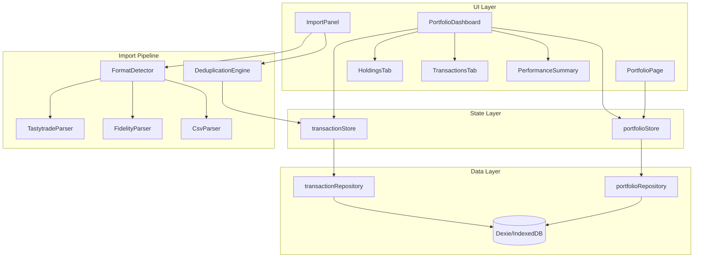
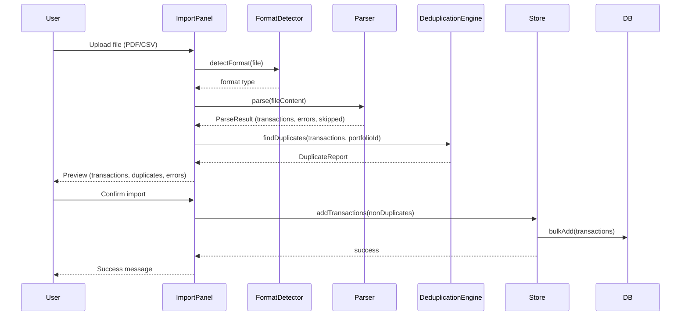

# Design Document: Portfolio Management

## Overview

Portfolio Management extends TradingParadise with multi-portfolio tracking, brokerage statement import (PDF and CSV), transaction de-duplication, and a dashboard with holdings, transactions, and performance metrics.

The feature builds on the existing Dexie/IndexedDB data layer, Zustand stores, and React component patterns already established in the app. It introduces two new subsystems:

1. **Import Pipeline** — file upload → format detection → parsing → de-duplication → preview → confirmation → persistence
2. **Portfolio Dashboard** — performance summary + tabbed Holdings/Transactions views

### Key Design Decisions

| Decision | Rationale |
|----------|-----------|
| Client-side PDF parsing via `pdf.js` | No server needed; keeps the app fully offline-capable |
| Fingerprint-based de-duplication | Deterministic, composable, and testable without external state |
| Separate `PortfolioTransaction` table from `TradeJournalEntry` | Decouples portfolio tracking from trade journaling; each feature evolves independently |
| Extend existing `CsvImporter` patterns | Consistency with current import UX; less new code |
| Tab state managed locally (not URL) | Simpler; no deep-linking requirement for tabs |

## Architecture



### Data Flow: Import Pipeline



## Components and Interfaces

### Component Hierarchy

```
PortfolioPage (list/grid of portfolios)
├── PortfolioForm (create/edit modal)
└── ConfirmDialog (delete confirmation)

PortfolioDashboardPage
└── PortfolioDashboard
    ├── PerformanceSummary (metrics cards)
    ├── TabNavigation (Holdings | Transactions)
    ├── HoldingsTab
    │   └── HoldingsTable
    ├── TransactionsTab
    │   ├── TransactionFilters
    │   ├── TransactionsTable
    │   └── Pagination
    └── ImportPanel
        ├── FileUpload (PDF + CSV)
        ├── ImportPreview
        │   ├── ImportStats
        │   ├── DuplicatesList
        │   └── PreviewTable (paginated)
        └── ImportConfirmation
```

### Key Interfaces

```typescript
// --- New: Portfolio Transaction Model ---

interface PortfolioTransaction {
  id: string;
  portfolioId: string;
  planId: string;
  transactionDate: Date;
  settlementDate?: Date;
  symbol: string;
  description: string;
  transactionType: TransactionType; // 'Buy' | 'Sell' | 'Dividend' | 'Fee' | 'Transfer' | 'Expiration' | 'Assignment'
  assetType: AssetType;            // 'Stock' | 'ETF' | 'Option' | 'Cash'
  optionType?: OptionType;         // 'Call' | 'Put' (only for options)
  strikePrice?: number;            // only for options
  expirationDate?: Date;           // only for options
  quantity: number;
  price: number;                   // per-share or per-contract price
  amount: number;                  // total transaction value (quantity * price + fees)
  fees: number;
  source: TransactionSource;       // 'tastytrade_pdf' | 'fidelity_pdf' | 'csv' | 'manual'
  rawDescription?: string;         // original text from statement for debugging
  createdAt: Date;
  updatedAt: Date;
}

type TransactionType = 'Buy' | 'Sell' | 'Dividend' | 'Fee' | 'Transfer' | 'Expiration' | 'Assignment';
type AssetType = 'Stock' | 'ETF' | 'Option' | 'Cash';
type TransactionSource = 'tastytrade_pdf' | 'fidelity_pdf' | 'csv' | 'manual';

// --- Import Pipeline Interfaces ---

interface ParseResult {
  transactions: PortfolioTransaction[];
  errors: ParseError[];
  skipped: number;
  total: number;
}

interface ParseError {
  row: number;
  content: string;
  reason: string;
  missingFields?: string[];
}

interface DuplicateReport {
  duplicates: DuplicateEntry[];
  unique: PortfolioTransaction[];
}

interface DuplicateEntry {
  transaction: PortfolioTransaction;
  existingId: string;
  fingerprint: string;
  overrideInclude: boolean; // user can override
}

interface TransactionFingerprint {
  transactionDate: string;  // ISO date string (date only, no time)
  symbol: string;           // uppercase, trimmed
  transactionType: TransactionType;
  optionType: string;       // 'Call' | 'Put' | 'None'
  strikePrice: string;      // toFixed(2), '0.00' for non-options
  price: string;            // toFixed(2)
  quantity: string;         // toFixed(4) to handle fractional shares
}

// --- Parser Interface (Strategy Pattern) ---

interface StatementParser {
  canParse(content: ArrayBuffer | string): boolean;
  parse(content: ArrayBuffer | string, portfolioId: string, planId: string): Promise<ParseResult>;
}

// --- Holdings Computation ---

interface Holding {
  symbol: string;
  assetType: AssetType;
  optionType?: OptionType;
  strikePrice?: number;
  expirationDate?: Date;
  netQuantity: number;
  averageCostBasis: number;
  totalCostBasis: number;
  currentValue: number;
  unrealizedPL: number;
}

// --- Performance Summary ---

interface PerformanceSummaryData {
  totalPortfolioValue: number;
  totalRealizedPL: number;
  totalUnrealizedPL: number;
  overallReturnPercentage: number;
  winRate: number;
  totalTransactions: number;
}

// --- Transaction Filters ---

interface TransactionFilterState {
  symbol: string;
  dateFrom: Date | null;
  dateTo: Date | null;
  transactionType: TransactionType | '';
  assetType: AssetType | '';
}
```

### Parser Strategy

The import pipeline uses a strategy pattern for format detection and parsing:

```typescript
// Format detection order:
// 1. Check file extension (.pdf vs .csv)
// 2. For PDFs: scan first pages for format-specific markers
//    - tastytrade: "tastytrade" or "Account Activity" header patterns
//    - Fidelity: "Fidelity" or "Transaction Detail" header patterns
// 3. Return appropriate parser or error

const parsers: StatementParser[] = [
  new TastytradeParser(),
  new FidelityParser(),
  new CsvParser(),
];

function detectAndParse(file: File, portfolioId: string, planId: string): Promise<ParseResult> {
  // Extension check → content-based detection → parse
}
```

## Data Models

### Existing Models (unchanged)

The feature reuses the existing `Portfolio` type without modification:

```typescript
// src/types/portfolio.ts — already exists
interface Portfolio {
  id: string;
  name: string;
  description: string;
  initialBalance: number;
  planId: string;
  createdAt: Date;
  updatedAt: Date;
}
```

### New: PortfolioTransaction Table

A dedicated table for portfolio transactions, completely separate from `TradeJournalEntry`:

```typescript
// src/types/transaction.ts — NEW
interface PortfolioTransaction {
  id: string;
  portfolioId: string;
  planId: string;
  transactionDate: Date;
  settlementDate?: Date;
  symbol: string;
  description: string;
  transactionType: TransactionType;
  assetType: AssetType;
  optionType?: OptionType;
  strikePrice?: number;
  expirationDate?: Date;
  quantity: number;
  price: number;
  amount: number;
  fees: number;
  source: TransactionSource;
  rawDescription?: string;
  createdAt: Date;
  updatedAt: Date;
}
```

**Why separate from TradeJournalEntry:**
- Portfolio transactions represent raw brokerage activity (buys, sells, dividends, fees, transfers)
- Journal entries represent curated trade analysis with strategy, notes, and win/loss tracking
- Different lifecycle: transactions are imported in bulk; journal entries are manually crafted
- Different fields: transactions have `amount`, `settlementDate`, `source`; journal entries have `strategy`, `notes`, `winLoss`
- Avoids polluting the journal with non-trade activity (dividends, fees, transfers)

### New: Transaction Fingerprint (computed, not stored)

```typescript
/**
 * A fingerprint is a deterministic string derived from transaction attributes.
 * Used for de-duplication during import.
 * 
 * Format: "YYYY-MM-DD|SYMBOL|TYPE|OPTION_TYPE|STRIKE(2dp)|PRICE(2dp)|QTY(4dp)"
 * Example: "2024-03-15|AAPL|Sell|Put|170.00|3.25|1.0000"
 */
function computeFingerprint(txn: PortfolioTransaction): string {
  const dateStr = formatDateISO(txn.transactionDate); // YYYY-MM-DD
  const symbol = txn.symbol.trim().toUpperCase();
  const type = txn.transactionType;
  const optType = txn.optionType ?? 'None';
  const strike = (txn.strikePrice ?? 0).toFixed(2);
  const price = txn.price.toFixed(2);
  const qty = txn.quantity.toFixed(4);
  return `${dateStr}|${symbol}|${type}|${optType}|${strike}|${price}|${qty}`;
}
```

### Database Schema (new table required)

```typescript
// Dexie schema update:
db.version(N).stores({
  // Existing tables unchanged
  portfolios: 'id, name, planId',
  journalEntries: 'id, planId, portfolioId, strategyId, stockSymbol, openDate, tradeStatus, optionType, winLoss',
  
  // NEW table for portfolio transactions
  portfolioTransactions: 'id, portfolioId, planId, transactionDate, symbol, transactionType, assetType, source'
});
```

### Holdings Computation Algorithm

Holdings are computed on-the-fly from portfolio transactions (not stored):

```
1. Filter transactions: portfolioId matches AND transactionType in ('Buy', 'Sell')
2. Group by composite key: (symbol, assetType, optionType, strikePrice, expirationDate)
3. For each group:
   a. netQuantity = sum(Buy quantities) - sum(Sell quantities)
   b. averageCostBasis = totalBuyCost / totalBuyQuantity (weighted average)
   c. totalCostBasis = averageCostBasis * netQuantity
   d. currentValue = netQuantity * latestPrice (from most recent transaction price for that symbol)
   e. unrealizedPL = currentValue - totalCostBasis
4. Exclude groups where netQuantity === 0
5. Sort by symbol ascending
```

### Performance Summary Computation

```
totalRealizedPL = sum of closed position P/L (computed from matching Buy/Sell pairs per symbol)
totalUnrealizedPL = sum(unrealizedPL) for all open holdings
totalPortfolioValue = initialBalance + totalRealizedPL + totalUnrealizedPL + sum(dividends) - sum(fees)
overallReturnPercentage = (totalPortfolioValue - initialBalance) / initialBalance * 100
winRate = count(closed positions with positive P/L) / count(all closed positions) * 100
```

### De-duplication Algorithm

```
Input: newTransactions[], existingTransactions[] (from same portfolio)

1. Build fingerprint set from existingTransactions
   existingFingerprints = Set(existingTransactions.map(computeFingerprint))

2. For each txn in newTransactions:
   fp = computeFingerprint(txn)
   if existingFingerprints.has(fp):
     mark as duplicate
   else:
     mark as unique

3. Return DuplicateReport { duplicates, unique }
```

### Tastytrade PDF Parsing Strategy

1. Extract text from PDF using `pdf.js` (pdfjs-dist)
2. Locate "Account Activity" or "Transaction History" section header
3. Parse line-by-line within that section:
   - Skip subtotals, page headers/footers, blank lines
   - Extract: date, description, quantity, price, fees, amount
4. For options: parse description format (e.g., "AAPL 03/15/24 P170") to extract symbol, expiration, strike, type
5. Map to `PortfolioTransaction` with `source: 'tastytrade_pdf'`

### Fidelity PDF Parsing Strategy

1. Extract text from PDF using `pdf.js`
2. Locate "Transaction Detail" section header
3. Parse transaction rows:
   - Date in MM/DD/YYYY format
   - Action: "YOU BOUGHT", "YOU SOLD", "REINVESTMENT", "DIVIDEND"
   - Symbol, description, quantity, price, amount, fees
4. Map action to transactionType (Buy/Sell/Dividend)
5. For options: extract type and strike from description
6. Map to `PortfolioTransaction` with `source: 'fidelity_pdf'`

## Correctness Properties

*A property is a characteristic or behavior that should hold true across all valid executions of a system — essentially, a formal statement about what the system should do. Properties serve as the bridge between human-readable specifications and machine-verifiable correctness guarantees.*

### Property 1: Portfolio validation accepts valid inputs and rejects invalid inputs

*For any* string with length between 1 and 100 (inclusive) that is not purely whitespace, the portfolio name validation SHALL accept it. *For any* string that is empty, longer than 100 characters, or composed entirely of whitespace, the validation SHALL reject it. *For any* number between 0.00 and 999,999,999.99 (inclusive), the initial balance validation SHALL accept it.

**Validates: Requirements 1.1, 1.6**

### Property 2: Cascading portfolio delete removes all associated transactions

*For any* portfolio with N associated transactions (where N ≥ 0), after deleting the portfolio, querying portfolio transactions by that portfolioId SHALL return an empty set.

**Validates: Requirements 1.5**

### Property 3: Transaction fingerprint determinism and field sensitivity

*For any* valid PortfolioTransaction, computing the fingerprint twice SHALL produce the same string (determinism). *For any* two transactions that differ in any one of the fingerprint fields (transactionDate, symbol, transactionType, optionType, strikePrice, price, quantity), their fingerprints SHALL differ. *For any* two transactions whose strikePrice and price values are equal when rounded to 2 decimal places, and all other fingerprint fields are identical, their fingerprints SHALL be equal.

**Validates: Requirements 4.1, 4.6, 4.7**

### Property 4: Duplicate detection excludes transactions with matching fingerprints

*For any* set of new transactions and existing transactions in the same portfolio, the de-duplication engine SHALL flag exactly those new transactions whose fingerprint matches any existing transaction's fingerprint. All non-matching transactions SHALL be included in the unique set.

**Validates: Requirements 4.2, 5.6**

### Property 5: CSV parsing extracts all valid rows with correct field mapping

*For any* valid CSV text with a header row containing at least "Stock Symbol" and "Open Date" columns, and N data rows where each row has a non-empty symbol and a parseable date, the parser SHALL produce exactly N PortfolioTransaction records with symbol and transactionDate fields matching the input values.

**Validates: Requirements 3.3, 3.4**

### Property 6: CSV parser skips invalid rows with error reporting

*For any* CSV row that has an empty/missing Stock Symbol or an unparseable Open Date, the parser SHALL exclude it from the entries list and include it in the errors list with the correct row number and reason.

**Validates: Requirements 3.7**

### Property 7: Holdings computation produces correct aggregation

*For any* set of Buy/Sell transactions in a portfolio grouped by (symbol, assetType, optionType, strikePrice, expirationDate), the computed holding SHALL have netQuantity equal to sum(Buy quantities) minus sum(Sell quantities), and averageCostBasis equal to total cost of Buy transactions divided by total Buy quantity. *For any* group where netQuantity equals zero, the holding SHALL be excluded from results.

**Validates: Requirements 6.2, 6.3, 6.4**

### Property 8: Transaction filtering returns only matching entries

*For any* set of portfolio transactions and any combination of filter criteria (symbol, dateFrom, dateTo, transactionType, assetType), every transaction in the filtered result SHALL satisfy all active filter conditions, and no transaction satisfying all conditions SHALL be excluded.

**Validates: Requirements 7.5**

### Property 9: Transaction sorting produces correct order

*For any* set of portfolio transactions and any sortable column with a specified direction (ascending or descending), the resulting list SHALL be ordered such that for every adjacent pair (a, b), a's sort value is ≤ b's sort value (ascending) or ≥ b's sort value (descending).

**Validates: Requirements 7.3, 7.4**

### Property 10: Performance metrics computation correctness

*For any* portfolio with initialBalance > 0 and any set of transactions, the computed metrics SHALL satisfy: totalRealizedPL = sum of closed position P/L (from matching Buy/Sell pairs), totalUnrealizedPL = sum(unrealizedPL) for all open holdings, totalPortfolioValue = initialBalance + totalRealizedPL + totalUnrealizedPL + sum(dividends) - sum(fees), and overallReturnPercentage = (totalPortfolioValue - initialBalance) / initialBalance × 100.

**Validates: Requirements 8.2**

### Property 11: Tastytrade parser round-trip consistency

*For any* valid set of transaction field values (symbol, transactionDate, transactionType, optionType, strikePrice, expirationDate, price, fees, amount), formatting them into tastytrade text representation then parsing that text SHALL produce a PortfolioTransaction with identical field values for all specified fields.

**Validates: Requirements 9.8**

### Property 12: Fidelity parser round-trip consistency

*For any* valid set of transaction field values, formatting them into Fidelity text representation then parsing that text SHALL produce a PortfolioTransaction where all numeric fields match within 0.01 tolerance and all date and string fields match exactly.

**Validates: Requirements 10.6**

### Property 13: Format detection correctness

*For any* PDF content containing tastytrade-specific markers ("tastytrade", "Account Activity", or "Transaction History" in expected positions), the format detector SHALL identify it as tastytrade format. *For any* PDF content containing Fidelity-specific markers ("Fidelity", "Transaction Detail"), the format detector SHALL identify it as Fidelity format.

**Validates: Requirements 2.2**

## Error Handling

### Import Pipeline Errors

| Error Scenario | Handling Strategy |
|---------------|-------------------|
| File too large (>10MB) | Reject immediately with size error; no parsing attempted |
| Invalid file extension | Reject with supported formats message |
| Unrecognized PDF format | Display error listing supported formats (tastytrade, Fidelity) |
| Corrupt/unparseable PDF | Display parsing failure error; no partial import |
| PDF with no transaction section | Return empty result with "no valid section found" error |
| Row missing required fields | Skip row, add to error list with field names and row number |
| Partial save failure | Display count of successfully saved entries; keep saved data |
| IndexedDB write failure | Display error with retry option; no data loss for already-saved entries |

### Portfolio CRUD Errors

| Error Scenario | Handling Strategy |
|---------------|-------------------|
| Empty/whitespace name | Inline validation error on form field |
| Duplicate name in same plan | Inline validation error with "name must be unique" message |
| Name exceeds 100 chars | Inline validation error with character count |
| Balance out of range | Inline validation error with allowed range |
| Delete with linked transactions | Confirmation dialog warns about permanent removal |
| Database write failure | Toast notification with error; form remains open for retry |

### Dashboard Errors

| Error Scenario | Handling Strategy |
|---------------|-------------------|
| Portfolio not found (invalid ID) | Display "Portfolio not found" with link back to list |
| No entries for metrics | Display all metrics as $0.00 / 0.0% |
| Division by zero (0 initial balance) | Display return percentage as 0.0%; avoid NaN |
| Date parsing failure in entries | Gracefully skip transaction in computation; log warning |

## Testing Strategy

### Property-Based Testing (fast-check)

The project already has `fast-check` installed. Each correctness property maps to a property-based test with minimum 100 iterations.

**Library:** `fast-check` (already in devDependencies)
**Runner:** `vitest`
**Minimum iterations:** 100 per property

**Test files:**
- `src/utils/__tests__/fingerprint.property.test.ts` — Properties 3, 4
- `src/utils/__tests__/csvImport.property.test.ts` — Properties 5, 6
- `src/utils/__tests__/holdings.property.test.ts` — Property 7
- `src/utils/__tests__/transactions.property.test.ts` — Properties 8, 9
- `src/utils/__tests__/metrics.property.test.ts` — Property 10
- `src/utils/__tests__/tastytradeParser.property.test.ts` — Property 11
- `src/utils/__tests__/fidelityParser.property.test.ts` — Property 12
- `src/utils/__tests__/formatDetector.property.test.ts` — Property 13
- `src/schemas/__tests__/portfolioValidation.property.test.ts` — Property 1

**Tag format:** Each test tagged with:
```typescript
// Feature: portfolio-management, Property N: <property text>
```

### Unit Tests (example-based)

- Portfolio CRUD operations (create, read, update, delete)
- Portfolio form validation edge cases
- Import preview UI states (empty, with duplicates, with errors)
- Tab navigation and keyboard accessibility
- Performance summary color-coding
- Pagination controls
- Empty states for holdings and transactions

### Integration Tests

- Full import flow: upload → parse → preview → confirm → verify in DB
- Portfolio delete cascade: delete portfolio → verify transactions removed
- Metrics reactivity: add transaction → verify metrics update
- Filter + sort combination on transactions tab

### Test Organization

```
src/
├── utils/__tests__/
│   ├── fingerprint.property.test.ts
│   ├── fingerprint.test.ts
│   ├── csvImport.property.test.ts
│   ├── holdings.property.test.ts
│   ├── transactions.property.test.ts
│   ├── metrics.property.test.ts
│   ├── tastytradeParser.property.test.ts
│   ├── fidelityParser.property.test.ts
│   └── formatDetector.property.test.ts
├── schemas/__tests__/
│   └── portfolioValidation.property.test.ts
├── components/portfolio/__tests__/
│   ├── PortfolioDashboard.test.tsx
│   ├── ImportPanel.test.tsx
│   ├── HoldingsTab.test.tsx
│   └── TransactionsTab.test.tsx
└── pages/__tests__/
    └── PortfolioPage.test.tsx
```

### Dependencies

- **pdfjs-dist** — PDF text extraction (new dependency for PDF import)
- **fast-check** — Property-based testing (already installed)
- **papaparse** — CSV parsing (already installed)
- **vitest** — Test runner (already installed)
- **@testing-library/react** — Component testing (already installed)

