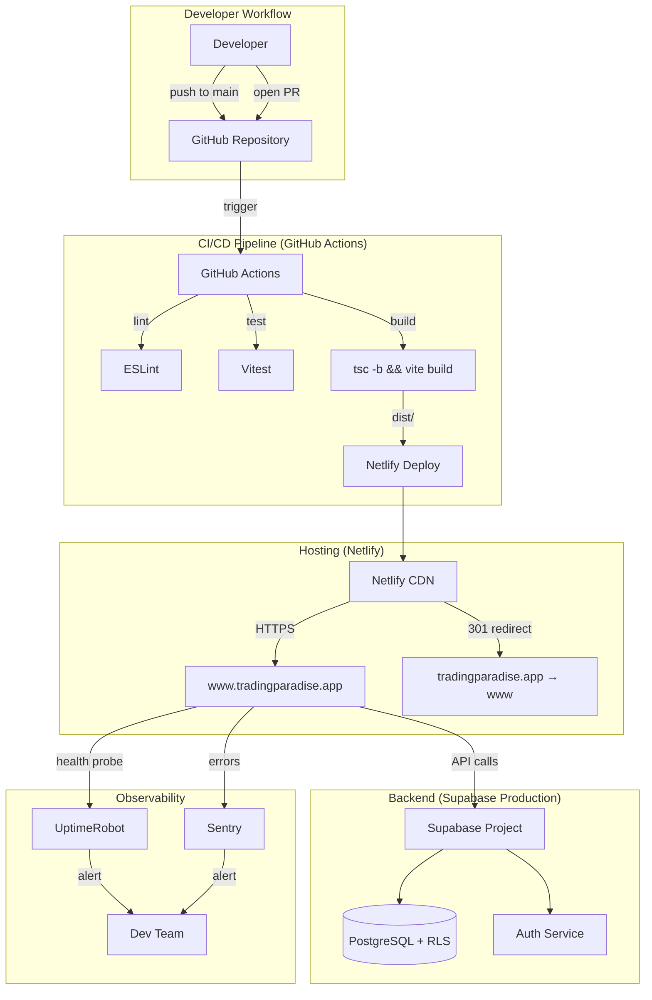

# Design Document: Website Launch

## Overview

This design specifies the architecture and configuration needed to deploy TradingParadise — a Vite + React 19 SPA with a Supabase backend — to production on Netlify, accessible at `www.tradingparadise.app`.

The deployment stack consists of:
- **Netlify** for static hosting, CDN, deploy previews, and SSL certificate management
- **GitHub Actions** for CI/CD orchestration (lint → test → build → deploy)
- **Supabase** (production project) for authentication, database, and RLS-enforced data access
- **Sentry** for error tracking with source map integration
- **UptimeRobot** (or equivalent) for health checks and uptime alerting

The application is a client-side SPA with no server-side rendering. All routes resolve to `index.html` via Netlify's rewrite rules, and the React Router handles path resolution in the browser.

## Architecture



### Request Flow

1. User navigates to `www.tradingparadise.app/journal`
2. DNS resolves to Netlify's CDN edge
3. Netlify serves `index.html` (SPA fallback rewrite)
4. Browser loads hashed JS/CSS bundles from CDN cache
5. React Router renders the `/journal` route
6. Component fetches data from production Supabase via `VITE_SUPABASE_URL`
7. Supabase enforces RLS — only the authenticated user's rows are returned

## Components and Interfaces

### 1. Netlify Site Configuration

**File: `netlify.toml`** (repository root)

Defines build settings, redirect rules, and headers for the Netlify deployment.

```toml
[build]
  command = "npm run build"
  publish = "dist"

[[redirects]]
  from = "/*"
  to = "/index.html"
  status = 200

[[headers]]
  for = "/index.html"
  [headers.values]
    Cache-Control = "no-cache"
    Strict-Transport-Security = "max-age=31536000; includeSubDomains"
    X-Content-Type-Options = "nosniff"
    X-Frame-Options = "DENY"
    Referrer-Policy = "strict-origin-when-cross-origin"

[[headers]]
  for = "/assets/*"
  [headers.values]
    Cache-Control = "public, max-age=31536000, immutable"
```

Key behaviors:
- The `/*` → `/index.html` rewrite with status 200 enables client-side routing without 404s
- `index.html` gets `no-cache` so users always fetch the latest deploy
- Hashed assets under `/assets/*` get immutable 1-year cache headers
- Security headers (HSTS, X-Frame-Options, etc.) are applied to all HTML responses

### 2. GitHub Actions CI/CD Workflow

**File: `.github/workflows/deploy.yml`**

Triggers on push to `main` and on pull requests. Handles the full lint → test → build → deploy pipeline.

```yaml
name: Deploy
on:
  push:
    branches: [main]
  pull_request:
    branches: [main]

env:
  NODE_VERSION: '20'

jobs:
  ci:
    runs-on: ubuntu-latest
    steps:
      - uses: actions/checkout@v4
      - uses: actions/setup-node@v4
        with:
          node-version: ${{ env.NODE_VERSION }}
          cache: 'npm'
      - run: npm ci
      - run: npm run lint
      - run: npm run test
      - name: Validate env vars
        run: |
          if [ -z "$VITE_SUPABASE_URL" ]; then echo "Missing VITE_SUPABASE_URL"; exit 1; fi
          if [ -z "$VITE_SUPABASE_ANON_KEY" ]; then echo "Missing VITE_SUPABASE_ANON_KEY"; exit 1; fi
        env:
          VITE_SUPABASE_URL: ${{ secrets.VITE_SUPABASE_URL }}
          VITE_SUPABASE_ANON_KEY: ${{ secrets.VITE_SUPABASE_ANON_KEY }}
      - run: npm run build
        env:
          VITE_SUPABASE_URL: ${{ secrets.VITE_SUPABASE_URL }}
          VITE_SUPABASE_ANON_KEY: ${{ secrets.VITE_SUPABASE_ANON_KEY }}
          VITE_SENTRY_DSN: ${{ secrets.VITE_SENTRY_DSN }}

  deploy-production:
    needs: ci
    if: github.ref == 'refs/heads/main' && github.event_name == 'push'
    runs-on: ubuntu-latest
    steps:
      - uses: actions/checkout@v4
      - uses: actions/setup-node@v4
        with:
          node-version: ${{ env.NODE_VERSION }}
          cache: 'npm'
      - run: npm ci
      - run: npm run build
        env:
          VITE_SUPABASE_URL: ${{ secrets.VITE_SUPABASE_URL }}
          VITE_SUPABASE_ANON_KEY: ${{ secrets.VITE_SUPABASE_ANON_KEY }}
          VITE_SENTRY_DSN: ${{ secrets.VITE_SENTRY_DSN }}
      - uses: nwtgck/actions-netlify@v3
        with:
          publish-dir: './dist'
          production-deploy: true
        env:
          NETLIFY_AUTH_TOKEN: ${{ secrets.NETLIFY_AUTH_TOKEN }}
          NETLIFY_SITE_ID: ${{ secrets.NETLIFY_SITE_ID }}

  deploy-preview:
    needs: ci
    if: github.event_name == 'pull_request'
    runs-on: ubuntu-latest
    steps:
      - uses: actions/checkout@v4
      - uses: actions/setup-node@v4
        with:
          node-version: ${{ env.NODE_VERSION }}
          cache: 'npm'
      - run: npm ci
      - run: npm run build
        env:
          VITE_SUPABASE_URL: ${{ secrets.VITE_SUPABASE_URL }}
          VITE_SUPABASE_ANON_KEY: ${{ secrets.VITE_SUPABASE_ANON_KEY }}
          VITE_SENTRY_DSN: ${{ secrets.VITE_SENTRY_DSN }}
      - uses: nwtgck/actions-netlify@v3
        with:
          publish-dir: './dist'
          production-deploy: false
          github-token: ${{ secrets.GITHUB_TOKEN }}
          enable-pull-request-comment: true
          enable-commit-comment: false
        env:
          NETLIFY_AUTH_TOKEN: ${{ secrets.NETLIFY_AUTH_TOKEN }}
          NETLIFY_SITE_ID: ${{ secrets.NETLIFY_SITE_ID }}
```

**Secrets required in GitHub repository settings:**
| Secret | Purpose |
|--------|---------|
| `VITE_SUPABASE_URL` | Production Supabase project URL |
| `VITE_SUPABASE_ANON_KEY` | Production Supabase anon key |
| `VITE_SENTRY_DSN` | Sentry project DSN for error reporting |
| `NETLIFY_AUTH_TOKEN` | Netlify personal access token for deploys |
| `NETLIFY_SITE_ID` | Netlify site identifier |

### 3. DNS and Domain Configuration

**DNS Records** (configured at domain registrar):

| Type | Name | Value | TTL |
|------|------|-------|-----|
| CNAME | www | `<site-name>.netlify.app` | 3600 |
| A | @ | Netlify load balancer IP (provided by Netlify) | 3600 |

Netlify handles:
- Automatic SSL certificate provisioning via Let's Encrypt
- Certificate renewal (30+ days before expiry)
- HTTP → HTTPS 301 redirect
- Apex (`tradingparadise.app`) → `www.tradingparadise.app` 301 redirect
- TLS 1.2+ enforcement (TLS 1.0/1.1 rejected)

### 4. Sentry Error Tracking Integration

**Package:** `@sentry/react` + `@sentry/vite-plugin`

Sentry captures unhandled exceptions with full context (stack trace, browser, OS, route, viewport) and uploads source maps at build time so minified traces resolve to original TypeScript locations.

**Initialization** (in `src/main.tsx` or a dedicated `src/lib/sentry.ts`):

```typescript
import * as Sentry from '@sentry/react';

Sentry.init({
  dsn: import.meta.env.VITE_SENTRY_DSN,
  environment: import.meta.env.MODE, // 'production' | 'development'
  integrations: [
    Sentry.browserTracingIntegration(),
    Sentry.replayIntegration({ maskAllText: true, blockAllMedia: true }),
  ],
  tracesSampleRate: 0.1,
  replaysSessionSampleRate: 0,
  replaysOnErrorSampleRate: 1.0,
  beforeSend(event) {
    // Strip PII — keep session ID but remove user-identifying info
    if (event.user) {
      delete event.user.email;
      delete event.user.username;
    }
    return event;
  },
});
```

**Vite plugin for source maps** (in `vite.config.ts`):

```typescript
import { sentryVitePlugin } from '@sentry/vite-plugin';

export default defineConfig({
  build: {
    sourcemap: true, // Required for Sentry source map upload
  },
  plugins: [
    // ... existing plugins
    sentryVitePlugin({
      org: 'tradingparadise',
      project: 'tradingparadise-web',
      authToken: process.env.SENTRY_AUTH_TOKEN,
    }),
  ],
});
```

The `SENTRY_AUTH_TOKEN` is used only at build time (in CI) and is not a `VITE_` prefixed variable — it never reaches the client bundle.

### 5. Route-Based Code Splitting

The current `App.tsx` imports all page components eagerly. To meet the 250 KB compressed JS budget per route, pages should be lazy-loaded:

```typescript
import { lazy, Suspense } from 'react';

const DashboardPage = lazy(() => import('./pages/DashboardPage'));
const PlanEditorPage = lazy(() => import('./pages/PlanEditorPage'));
const JournalPage = lazy(() => import('./pages/JournalPage'));
// ... etc for all page components
```

Each route's chunk loads only when navigated to. The shell (AppShell, Header, Sidebar, auth logic) remains in the main bundle since it's needed on every page.

### 6. Production Supabase Project

A separate Supabase project is provisioned for production. Configuration requirements:

| Setting | Value |
|---------|-------|
| RLS | Enabled on all tables with `user_id` column |
| Auth providers | Email/password with email confirmation required |
| Rate limiting | 30 requests per IP per 5 minutes (sign-up/login) |
| Redirect URLs | `https://www.tradingparadise.app/*` only |
| Direct DB access | Restricted to `service_role` and owner credentials |

Migrations from `supabase/migrations/` are applied in order (001, 002, ...) using the Supabase CLI during initial setup and subsequent schema changes.

### 7. Health Check Service

**UptimeRobot** (free tier) configured to:
- Send HTTP GET to `https://www.tradingparadise.app/` every 5 minutes
- Alert via email/Slack if 2 consecutive checks fail (non-2xx or timeout > 30s)
- Monitor SSL certificate expiry (alert at 14 days remaining)

## Data Models

This feature introduces no new application data models. The relevant configuration data structures are:

### Environment Variables Schema

```typescript
// Build-time environment variables (injected by Vite)
interface ImportMetaEnv {
  readonly VITE_SUPABASE_URL: string;      // e.g., "https://abc123.supabase.co"
  readonly VITE_SUPABASE_ANON_KEY: string; // Supabase anon/public key
  readonly VITE_SENTRY_DSN: string;        // e.g., "https://key@sentry.io/project"
  readonly MODE: string;                    // "production" | "development"
}
```

### Netlify Deploy Context

```typescript
// Netlify provides these at build time (not used in app code, used in CI)
interface NetlifyContext {
  NETLIFY_AUTH_TOKEN: string;  // Personal access token
  NETLIFY_SITE_ID: string;    // Site identifier
}
```

### Sentry Event Shape (outbound)

Sentry events include:
- Stack trace (resolved via source maps)
- Browser name/version, OS
- Viewport dimensions
- Current route (`window.location.pathname`)
- Anonymous session ID (no PII linkage)

No user email, name, or trading data is sent to Sentry.

## Error Handling

### Build Failures

- **Missing env vars**: The CI workflow validates `VITE_SUPABASE_URL` and `VITE_SUPABASE_ANON_KEY` before running `vite build`. If either is empty, the job exits with a clear error message naming the missing variable.
- **TypeScript errors**: `tsc -b` runs first; type errors fail the build before bundling.
- **Lint failures**: ESLint runs before tests; lint errors halt the pipeline.
- **Test failures**: Vitest runs after lint; test failures prevent build and deploy.

### Deploy Failures

- **Netlify deploy failure**: The GitHub Actions step reports failure status on the commit. The previous production deploy remains live (Netlify atomic deploys).
- **SSL provisioning failure**: Netlify retries automatically and sends email notification. The site remains accessible on the previous certificate until expiry.

### Runtime Errors

- **Unhandled exceptions**: Caught by Sentry's global error handler. Grouped by stack trace signature. Team notified within 5 minutes of a new error group.
- **Supabase unavailability**: The existing `ErrorBoundary` component catches render errors. Network failures surface via the app's existing error states in data-fetching hooks.
- **Site unavailability**: UptimeRobot detects via failed health checks (2 consecutive failures) and alerts the team.

### Migration Failures

- Supabase migrations run in transactions. A failed migration rolls back automatically — no partial schema changes persist.
- The deployment process halts and reports the failing migration file name and error.

## Testing Strategy

Property-based testing is **not applicable** to this feature. The work is infrastructure configuration, CI/CD pipeline setup, DNS management, and third-party service integration. None of these involve pure functions with meaningful input variation. Testing uses smoke tests, integration checks, and manual verification instead.

### Smoke Tests (automated, post-deploy)

1. **Site accessibility**: HTTP GET to `https://www.tradingparadise.app/` returns 200 with `Content-Type: text/html`
2. **SPA routing**: HTTP GET to `https://www.tradingparadise.app/journal` returns 200 (not 404)
3. **HTTPS redirect**: HTTP GET to `http://www.tradingparadise.app/` returns 301 → HTTPS
4. **Apex redirect**: HTTP GET to `https://tradingparadise.app/` returns 301 → `www`
5. **HSTS header**: Response includes `Strict-Transport-Security` with correct max-age
6. **Asset caching**: Request to a hashed asset returns `Cache-Control: public, max-age=31536000, immutable`

### Integration Tests (CI pipeline)

1. **Build succeeds**: `npm run build` exits 0 with `dist/index.html` present
2. **Env var validation**: Build fails when required vars are missing
3. **Source maps generated**: `dist/assets/*.js.map` files exist after build

### Manual Verification Checklist

1. Custom domain resolves and serves the app
2. SSL certificate is valid for both apex and www
3. Login/signup flow works against production Supabase
4. RLS prevents cross-user data access
5. Sentry receives a test error with resolved source maps
6. UptimeRobot health check is green
7. Netlify deploy preview works on a test PR

### Performance Validation

- Run Lighthouse CI in the GitHub Actions workflow (optional enhancement)
- Target: LCP < 2.5s, TTI < 3.5s on simulated 4G
- Verify initial route JS < 250 KB compressed via `vite-bundle-visualizer`
